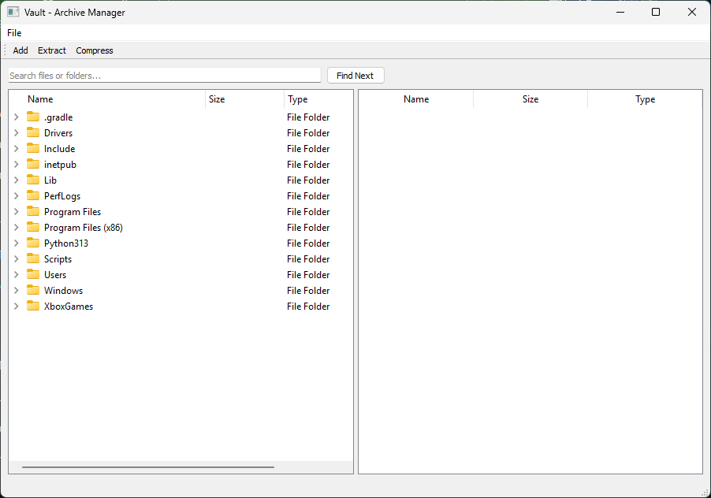

# VAULTS

Vaults is a simple GUI-based application that allows you to group multiple files into a single archive-like file called a "vault", similar to ZIP files. It enables easy compression, extraction, and management of grouped files using a clean interface.

## Features

- Compress multiple files into a single vault
- Extract specific or all files from a vault
- Add files to existing vaults
- Built-in file explorer with search functionality

## Getting Started

1. **Download and Extract**  
   Download the `.zip` file from GitHub and extract its contents.

2. **Run the Application**  
   Open a terminal or double-click `main.py` in the top-level directory.

3. **Install Dependencies (if needed)**  
   If you are missing dependencies, a popup will guide you to install them.

Once launched, the main interface will appear, allowing you to manage vaults easily.

## Requirements

- Python 3.10+
- PyQt5 (or any other dependencies prompted on launch)

## Interface Overview

- **Top Left Corner**: Displays the name of the selected file or the last selected file.
- **Buttons**:
  - `Add`: Add files to an existing vault
  - `Extract`: Extract files from a vault
  - `Compress`: Create a new vault from selected files
- **Search Bar**: Use the search field to locate files, and use `Find Next` to cycle through results.
- **File Tree**: Navigate your local file system.
- **Vault View**: Shows contents of the selected vault.

## Using the Buttons

### 🔹 Add Button
Adds files to an existing vault:
1. Select a vault file in the file tree.
2. Click `Add`.
3. Choose the files to add.
4. The files will be appended to the vault.

### 🔹 Extract Button
Extracts files from a vault:
1. Select a vault file.
2. Click `Extract`.
3. Choose specific files or extract all.
4. If all files are extracted, the vault will be deleted.

### 🔹 Compress Button
Creates a new vault:
1. Select one or more files in the file tree.
2. Click `Compress`.
3. Enter a name for your new vault (ensure it's unique).
4. The selected files will be bundled into a vault.

## File Selection Tips

- `SHIFT + Left Click`: Selects a range of files.
- `CTRL + Left Click`: Selects multiple files individually.

## Example

### 🔹 GUI

